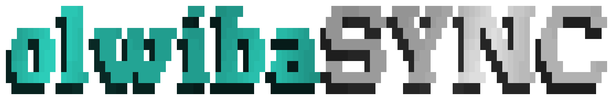

<p align="center">
  <picture>
    <source media="(prefers-color-scheme: light)" srcset="./public/olwibaSYNC--light.gif" />
    <source media="(prefers-color-scheme: dark)" srcset="./public/olwibaSYNC.gif" />
    
  </picture>
</p>

<p align="center">
  <strong>Check and sync @olwiba/* package versions against the live registry.</strong>
</p>

<p align="center">
  <a href="https://github.com/Olwiba/olwibaSYNC/issues/new?template=bug_report.md">🪲 Report a bug</a> ·
  <a href="https://github.com/Olwiba/olwibaSYNC/issues/new?template=feature_request.md">✨ Feature request</a>
</p>

<p align="center">
  <a href="https://github.com/sponsors/Olwiba"></a>
  <a href="LICENSE"></a>
  <a href="https://github.com/Olwiba/olwibaSYNC/issues"></a>
</p>

## What This Is

`@olwiba/sync` checks your project's `@olwiba/*` package versions against the live registry — and can apply updates when you're ready.

It also reports **template drift**: how far a Genesis-spawned project has moved from the template it came from, and which template changes it can still adopt safely.

Works with any project using Olwiba packages.

## Installation

```bash
bun add @olwiba/sync
```

Or run without installing:

```bash
bunx @olwiba/sync
```

## Usage

```bash
# Check cwd (read-only, default)
bunx @olwiba/sync
bunx @olwiba/sync check

# Check a specific project
bunx @olwiba/sync check ./my-app

# Check then apply all recommended updates
bunx @olwiba/sync sync

# Apply updates for specific packages only
bunx @olwiba/sync sync cn ui

# Scoped project
bunx @olwiba/sync sync -- ./my-app
bunx @olwiba/sync sync cn -- ./my-app
```

### Template drift

Packages propagate through npm. The template does not — a project scaffolded from
Genesis is a fork from the moment it is created, and nothing otherwise reports what
it is owed.

```bash
# How far has this project moved from the template?
bunx @olwiba/sync template ./my-app --template ../genesis

# Which template changes since a ref can still be adopted?
bunx @olwiba/sync template ./my-app --template ../genesis --since v0.2.0

# List every file instead of a capped sample
bunx @olwiba/sync template ./my-app --template ../genesis --since v0.2.0 --all
```

`--since` splits the template's changes into three buckets:

| Bucket | Meaning |
|---|---|
| **adoptable** | The template changed it; the project never diverged from `ref`. Copy it over. |
| **conflict** | Both sides changed it. Needs a human. |
| **absent** | The template changed a file the project does not have (stripped module, or deleted). |

This needs no baseline file in the project. Comparing the project's copy against the
template *at `ref`* is enough — identical means the project never diverged, so the
newer version can be taken wholesale.

Read-only. It never writes to the project.

## What's Included

**Drift report** Compares installed `@olwiba/*` versions against the live registry  
**Recommended updates** Lists exact version bumps needed per project  
**Sync** Applies updates via `bun add` (does not auto-commit)  
**Multi-project check** Inspect multiple consumer projects in one command  
**Package filters** Sync only the packages you name (`cn`, `ui`, `@olwiba/cn`, …)  
**Template drift** File-level divergence from the Genesis template, grouped by area  
**Adoption queue** Splits template changes into adoptable / conflict / absent

## Ecosystem

- [@olwiba/cn](https://github.com/Olwiba/olwibaCN) — base UI primitives
- [@olwiba/ui](https://github.com/Olwiba/olwibaUI) — app-level blocks
- [@olwiba/render](https://github.com/Olwiba/olwibaRENDER) — JSON-to-UI rendering

## Contributing

Bug reports, pull requests & feature requests are welcome.
Open an issue first for anything beyond a small fix.

<br/>
<br/>

<p align="center">
  Built with 💖 by <a href="https://github.com/Olwiba">Olwiba</a>
</p>

<p align="center">
  <a href="https://buymeacoffee.com/olwiba"></a>
</p>
