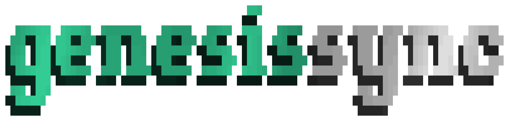

<p align="center">
  <picture>
    <source media="(prefers-color-scheme: light)" srcset="./public/genesis-sync--light.gif" />
    <source media="(prefers-color-scheme: dark)" srcset="./public/genesis-sync.gif" />
    
  </picture>
</p>

<p align="center">
  <strong>Read-only package drift inspector for the Genesis ecosystem.</strong>
</p>

<p align="center">
  <a href="https://github.com/Olwiba/genesis-sync/issues/new?template=bug_report.md">🪲 Report a bug</a> ·
  <a href="https://github.com/Olwiba/genesis-sync/issues/new?template=feature_request.md">✨ Feature request</a>
</p>

<p align="center">
  <a href="https://github.com/sponsors/Olwiba"></a>
  <a href="LICENSE"></a>
  <a href="https://github.com/Olwiba/genesis-sync/issues"></a>
</p>

## What This Is

`@olwiba/genesis-sync` checks your project's `@olwiba/*` package versions against the live registry and reports what's out of date.

No writes, no installs — inspect only.

## Installation

```bash
bun add @olwiba/genesis-sync
```

Or run without installing:

```bash
bunx @olwiba/genesis-sync
```

## Usage

```bash
# Check the project in the current directory
genesis-sync

# Check an explicit path
genesis-sync check /path/to/my-project

# Check multiple paths
genesis-sync check /path/to/project-a /path/to/project-b
```

Private packages require a GitHub token with `read:packages` scope:

```bash
PACKAGES_TOKEN=ghp_... genesis-sync
```

## What's Included

**Drift report** Compares installed `@olwiba/*` versions against the live registry  
**Recommended updates** Lists exact version bumps needed per project  
**Multi-project** Check multiple consumer projects in one command  
**Read-only** Never modifies `package.json` or installs anything  

## Ecosystem

- [genesis](https://github.com/Olwiba/genesis) — the baseline being tracked
- [@olwiba/genesis-start](https://github.com/Olwiba/genesis-start) — scaffold a new baseline
- [@olwiba/cn](https://github.com/Olwiba/olwibaCN) — base UI primitives

## Contributing

Bug reports, pull requests & feature requests are welcome.
Open an issue first for anything beyond a small fix.

<br/>
<br/>

<p align="center">
  Built with 💖 by <a href="https://github.com/Olwiba">Olwiba</a>
</p>

<p align="center">
  <a href="https://buymeacoffee.com/olwiba"></a>
</p>
